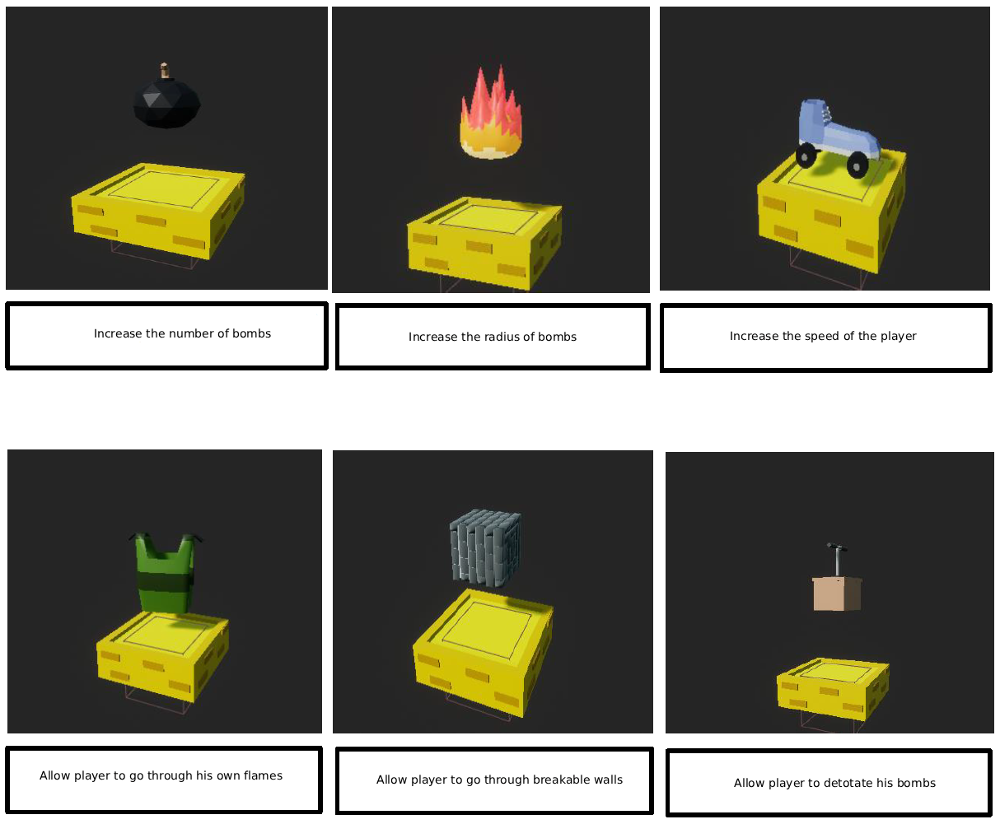

# 🎮 Bomberman Remake - Unreal Engine 5

A modern recreation of the classic Bomberman game for mobile built with **Unreal Engine 5**, featuring enhanced graphics, smooth gameplay mechanics, 50 unique levels, bonus levels, end cinematic and exciting power-ups.

## 📸 Screenshots & Media

***Gameplay Demo*** *(Click me !)*

### Game Screenshots

*Main gameplay showing the arena and player character*

*Pause menu showing all the currents power-ups*

*Main menu showing the leaderboard and diverse buttons*

### Character Gallery

#### 🏃 Player Character

*The iconic Bomberman character with modern 3D graphics*

#### 👾 Enemies

*Collection of all enemy types with unique behaviors and AI patterns*

#### 🎁 Power-ups & Bonuses

*All available power-ups including bomb range, speed boosts, and special abilities*

## 🎥 Development Journey - Weekly Reports

Follow the complete development process through our weekly progress videos:

### Weekly Development Reports
**Week 1** *(Click me !)*

**Week 2** *(Click me !)*

**Week 3** *(Click me !)*

**Week 4** *(Click me !)*

**Week 5** *(Click me !)*

**🎬 Final Demo** *(Click me !)*

## 🚀 Features

### Core Gameplay
- **Classic Bomberman mechanics** with modern enhancements
- **Smooth player movement** and responsive controls
- **Dynamic bomb system** with customizable explosion patterns
- **Interactive destructible environment**

### Power-up System
- **Bomb Range Enhancement** - Increase explosion radius
- **Speed Boost** - Enhanced player movement
- **Extra Bombs** - Place multiple bombs simultaneously
- **Special Abilities** - Unique power-ups for strategic gameplay

### Technical Features
- **Advanced AI System** for enemy behaviors
- **Particle Effects** for explosions and visual feedback
- **Dynamic Audio System** with spatial sound
- **Optimized Performance** for smooth 60+ FPS gameplay

## 🛠️ Technical Stack

- **Engine**: Unreal Engine 5.2
- **Programming Language**: C++
- **Target Platforms**: Windows, Android, iOS
- **Used Tools**: Visual Studio, Unreal Editor, Blender, send2unreal

## 🎯 Game Mechanics

### Player Controls
- **Movement**: ZQSD / Arrow Keys
- **Place Bomb**: Spacebar
- **Special Action**: E key
- **Pause/Menu**: ESC
- **Touch screen**

### Scoring System
- **Enemy Elimination**: Points based on enemy type
- **Power-up Collection**: Strategic scoring for item collection
- **Bonus Levels**: with invincibility and respawning ennemies

---

**Developed by**: SERRANO Alexis
**Development Period**: 6 weeks, from July to August 2023
**Engine Version**: Unreal Engine 5.2
